# Azure AI Studio - PromptFlow Workshop
This repository aims to provide step by step to guide developer to develop end to end use cases for RAG pattern.

## What we will build
This sample is based on popular generative AI application pattern, retrival augmented generation (RAG), while providing the flexibility to refine the system prompt for more relevant response. In this sample, we will build a chatbot that answer questions based on standard of procedure document for corporate security in ficticious company called Contoso. User can talk to this chatbot via Microsoft Teams or M365 copilot in future.

## Pre-requisite
1. Azure subscription
2. Access to Azure Open AI / Open AI
3. (Optional, but highly recommended) Copilot Studio (Power Virtual Agent)
4. (Optional) Microsoft Teams as interface to chatbot

## Step 0: Deploy Necessary Azure Resources
[Template coming soon]
1. Azure Open AI (GPT3.5, Ada)
2. Azure AI Search
3. Azure Functions
4. Azure AI Studio
5. Azure Storage Account
6. Azure AI Content Safety

## Step 1: Data Preparation (Optional)
Firstly, we will generate dummy data using Bing Chat. Navigate to **Dummy Data Preparation** folder for the prompts and get sample data.

Store the documents in a container under Azure storage.


## Step 2: Prepare Seach Indexer
In this example, we will use Azure Storage as the file repository to store document, and leverage Azure AI Search to index document and serves as a vector DB. To achive this, firstly, we need to have a pipeline that perform optical character recognition (OCR) on the documents to extract the content, then index them in Azure AI Search.

A simple way to achieve this is to leverage [Azure AI Studio](https://ai.azure.com).


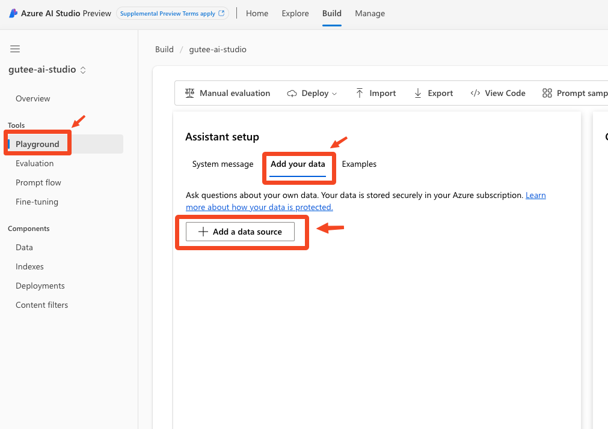

Azure AI Search resource is created above, or your can select your existing Azure AI Search service. Make sure to tick "Add vector search to this search resource", this option will embed the content before the indexing.


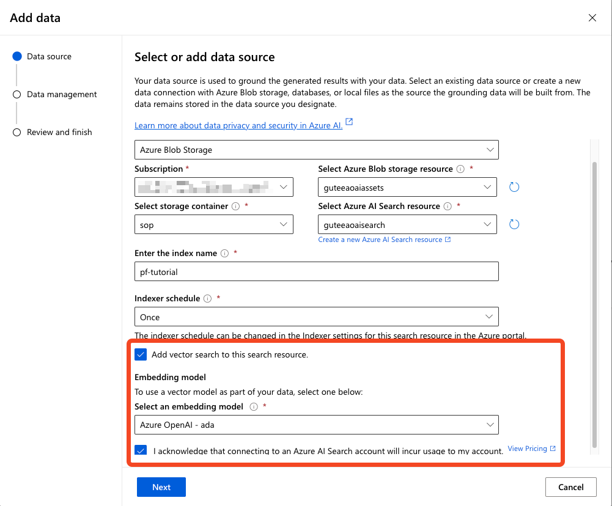

Click Next. Under search type, select "Hybrid + semantic". You can select other option based on your use cases. Then, select save and close.

#### Notes
Behind the scene, this dialog will create a temporary Azure AI Search skillsets to perform OCR, slice the document and ingest to Azure AI Search for indexing. The skillsets will then be deleted after ingestion.

For use cases that requires more control, you can always perform the steps above manually using custom script, hence you can then skip this step.

## Step 3: Create Prompt Flow
Create a blank Prompt Flow.

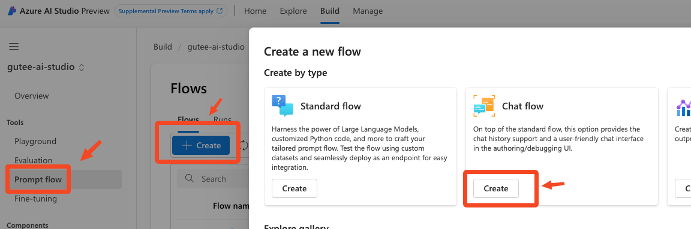

This prompt flow applies RAG pattern, and it's up to developer to further customize the flow, for example, combining information from web search, apply custom logic like access control etc. For the purpose of this workshop, we will apply RAG using the index created above.

The flow is as below:
1. Embed the input from user
2. Perform vector search on the index
3. construct grounding context
4. generate prompt
5. send prompt to Azure Open AI

Azure AI Studio provides a serverless runtime option for testing purposes. Start the runtime first.

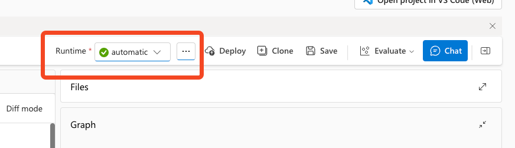

Start with embedding. Prompt flow provides built-in connector to perform this step.

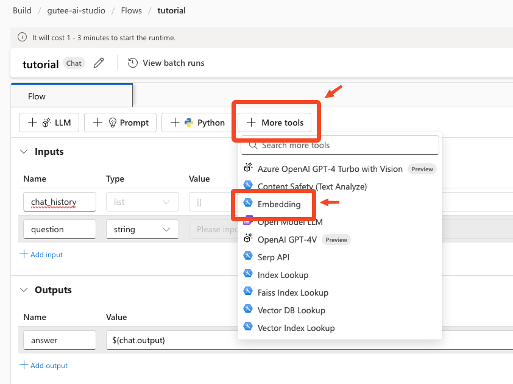

Give the node a name, and select the right connection name. We are going to embed the question from user, **${inputs.question}** allows prompt flow to access the question from user.

Here's a sample.

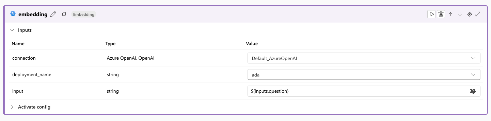

Next, add a node using **Vector DB Lookup**. You can find it under **+ More tools**, just like above. Give the node a name.

Select connection name, and provide the index that we named earlier on during ingestion. **text_field**, **vector_field** refers to the schema returned from Azure AI search, so we can provide the key accordingly. Lastly, the vector that we going to search against is the output from the embedding node above. Select accordingly based on your naming convention. Here's a sample.

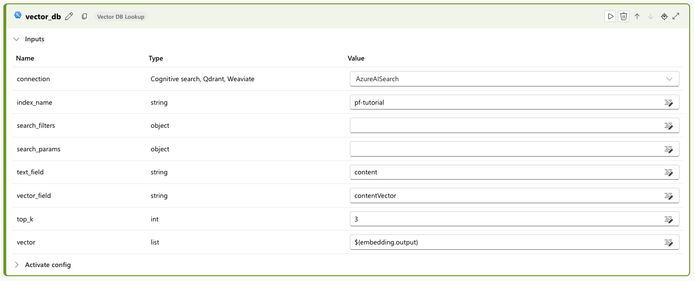

The next step is to convert the vector back to string. We will use python script to complete this. Add a python node, and name it accordingly.

Copy the code from the file [./PromptFlow/generate_prompt_context.py](./PromptFlow/generate_prompt_context.py). This is sample script to generate a list, with content and source. It will be used as the grounding context for our prompt later on. Click **Validate and parse input** button to validate the script, and select the output from the vector DB search node above. Here's a sample:

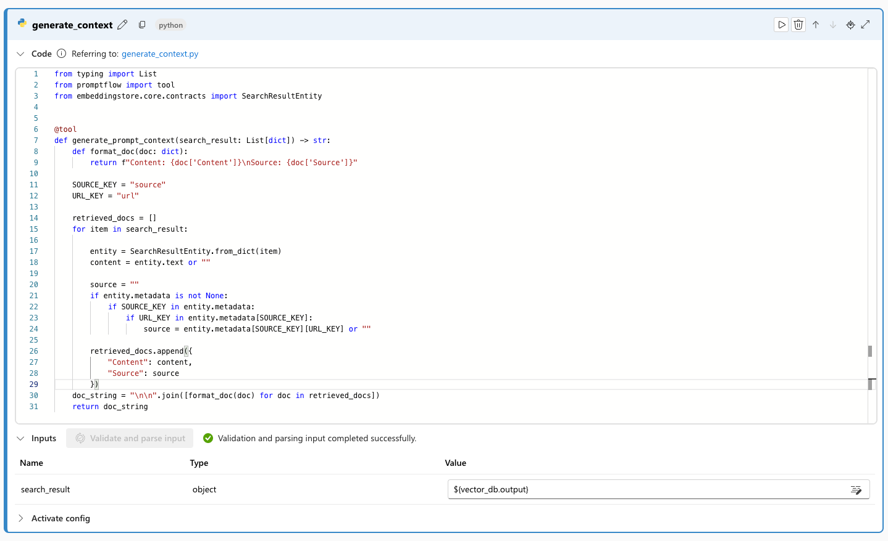

We are ready to create our prompt now. Add a new node using **+ Prompt** above.Copy the template from [./PromptFlow/prompt_variant.txt](./PromptFlow/prompt_variant.txt). Then, validate and parse the input. Select the field accordingly, namely chat history, chat input and contexts. Chat history is an array with a format which we will discuss later on. Under context, select the output from the previous node. Here's a sample:

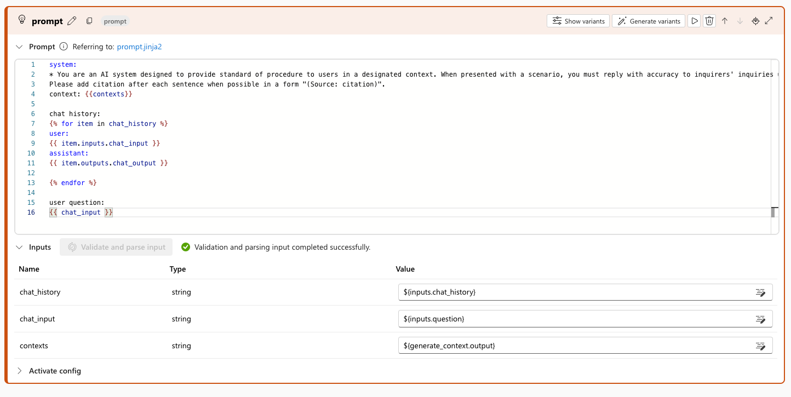

Lastly, add a node using **+ LLM**. Here, we will use Azure Open AI. Give the node a name, select the connection name, deployment, and configure necessary settings such as temperature and max tokens.

Under prompt, simply type the following, and click **validate and parse input**.

```text
{{ prompt_text }}
```

Then, select the output from previous node as the input for this node. Here's a sample:

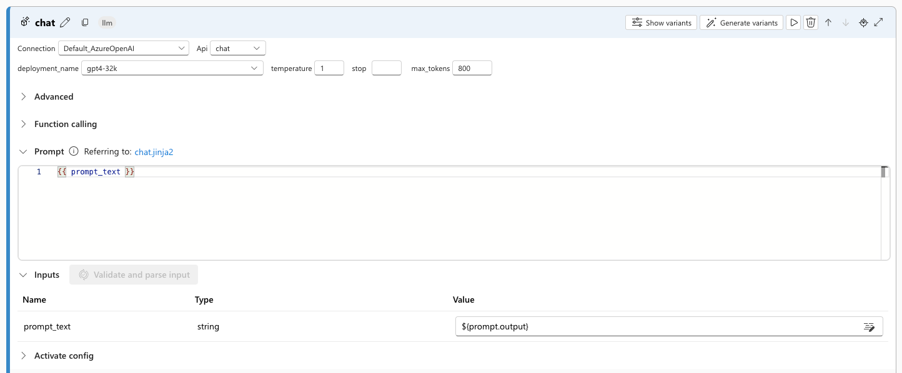

If all nodes are configured properly, the prompt flow graph should looks something like this:

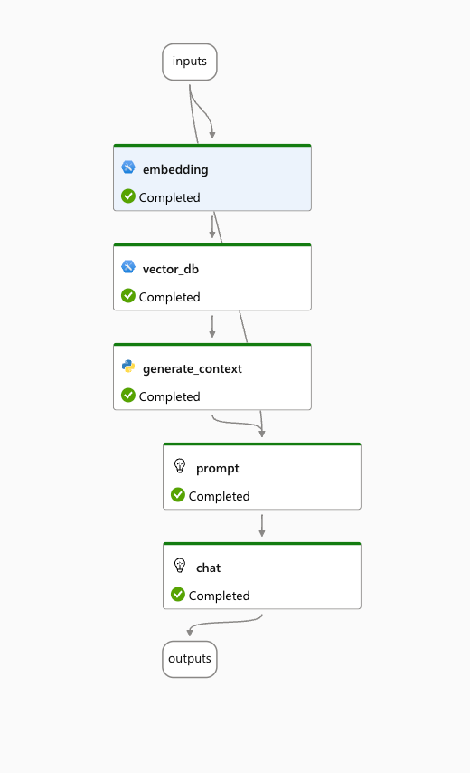

This is the beauty of prompt flow, where it provides developer a visual way to understand the steps of each node, and the dependencies with each other.

We are ready to test now! Save the flow, and click **Chat** above. If you encounter warning message on search filter, you can click **send anyway**.

Here's a sample:

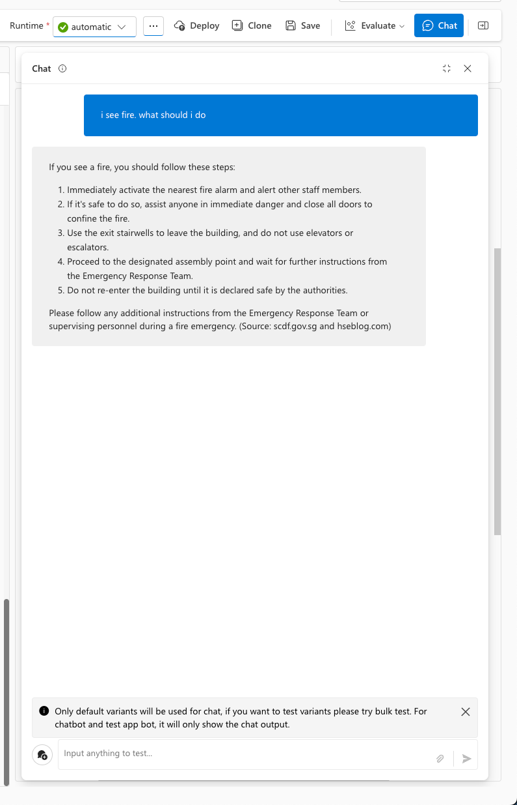

You can continue to develop, refine the prompt accordingly based on the business needs. Once done, let's proceed with the deployment.

Select **Deploy** at top right corner. This will deploy our prompt flow into a managed hosted endpoint, where we can consume this flow via a rest API.

Select the appropriate VM sku to host this endpoint. For production, it is recommended to have at least 3 replicas.

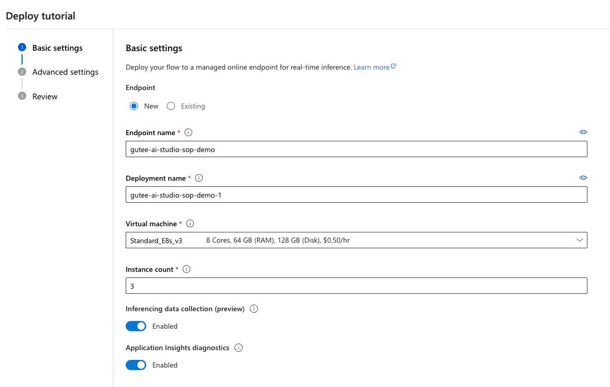

Click next. Select key-based authentication. We will assign the role based access control for this endpoint post deployment. Keep the rest of the setting as default setting. At the last page, review the connection details and update accordingly. Click **Review + Create** and wait for few minutes.

You can review the progress under **Deployments**.

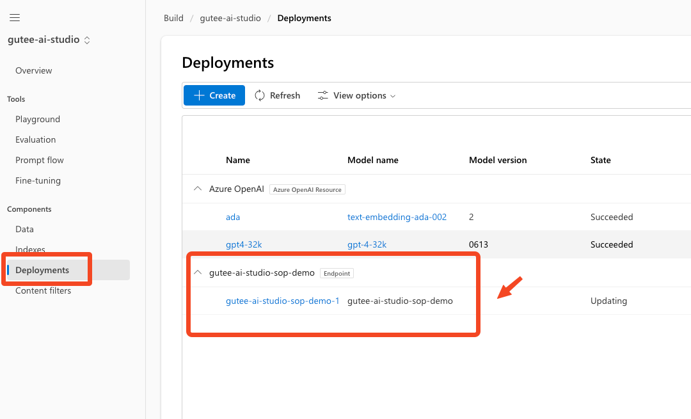

Once done, take note of the inference url, deployment name and the key.

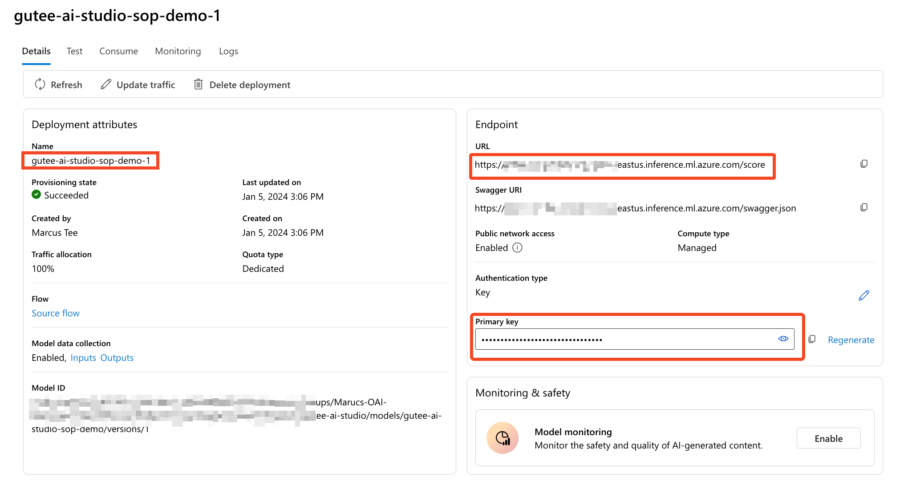

## Step 4: Deploy Azure Functions
This step is to bootstrap the endpoint above, and include additional capability on storing and retriving conversation history based on conversation history. Refer to [Azure Functions](./Azure%20Functions/README.md) for further details.

## Step 5: Work in progress
You can now create a chatbot based on copilot studio / Azure Bot Services and connect with the endpoint from Azure Functions.

